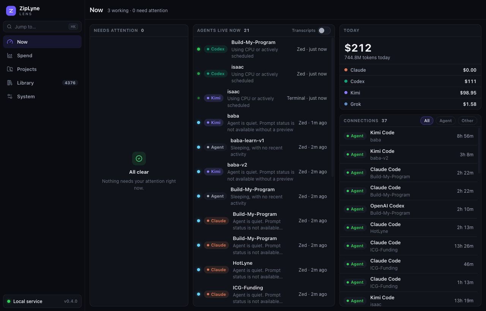
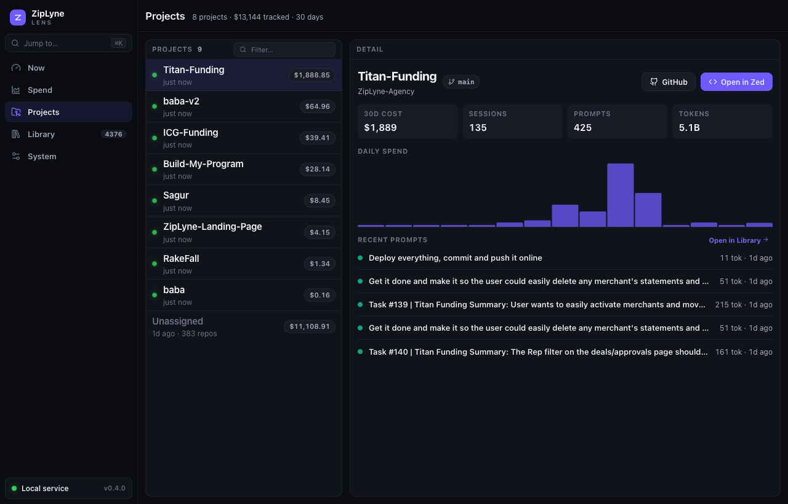
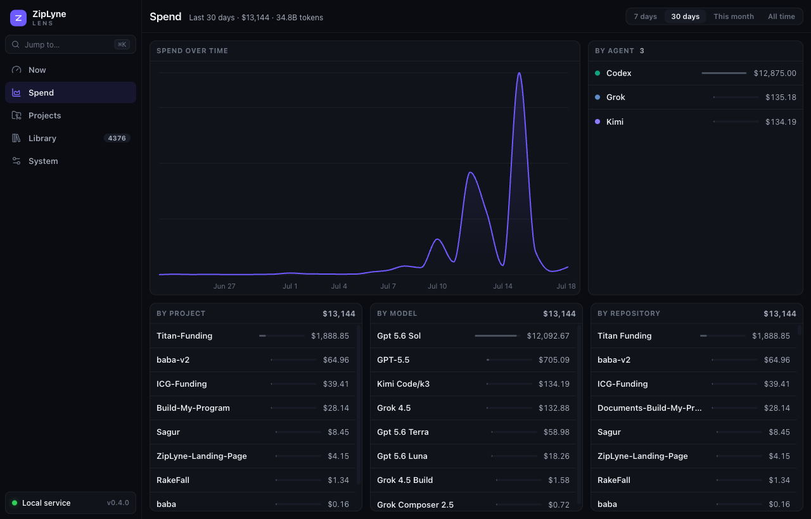

# ZipLyne Lens

**See exactly what your AI coding tools cost, per project, right on your Mac.**

ZipLyne Lens reads the logs that Claude Code, Codex CLI, Kimi Code, and Grok
CLI already keep on your computer and turns them into a clear picture: how much
you are spending, which projects and repositories the spend belongs to, which
models you rely on, and what prompts drove the work. Everything stays on your
Mac.

<p align="center">
  <a href="https://github.com/ZipLyne-Agency/Ziplyne-Lens/releases/latest/download/ZipLyne-Lens.dmg">
    
  </a>
  &nbsp;
  <a href="https://github.com/ZipLyne-Agency/Ziplyne-Lens/releases/latest">
    
  </a>
</p>

<p align="center">
  
</p>

---

## Download and open (no setup)

1. Click **[Download for macOS](https://github.com/ZipLyne-Agency/Ziplyne-Lens/releases/latest/download/ZipLyne-Lens.dmg)**. The `.dmg` downloads right away.
2. Open it and drag **ZipLyne Lens** into your Applications folder.
3. Open the app. That is it.

Lens is signed and notarized by Apple, so it just opens. It finds your Claude
Code, Codex CLI, Kimi Code, and Grok CLI usage automatically and shows you the
numbers. Nothing to configure, no account, no sign in.

Installed builds can check for updates from **System → Preferences**. Lens
verifies every update with its embedded updater public key before installation,
then relaunches into the new version.

> Prefer to try the interface without installing the desktop app? Run the web
> dashboard from source; when its local API is unavailable, that browser-only
> development mode uses realistic sample data. The installed app always shows
> local results and never mixes sample data into your analytics.

## What you get

Five workspaces, each designed to answer one question at a glance — no page
scrolling anywhere, only lists scroll.

- **Now.** Mission control. What needs your attention right now, every agent
  session running on this Mac (with Working/Quiet states and optional Terminal
  transcripts), your active remote connections (SSH, databases, tunnels, cloud
  CLIs), and today's burn per agent.
- **Spend.** What is all of this costing? Cost over time, broken down by
  agent, project, model, and repository — one screen, every answer.
- **Projects.** Take me to my work. Every project on this Mac, most recent
  first, with its GitHub link, current branch, 30-day cost, and one click to
  open it in Zed. Select one for its sessions, daily spend, and prompts.
- **Library.** What did I ask? A searchable library of every prompt, with
  secrets stripped out before anything is stored.
- **System.** Is everything set up right? Connected agents, the CLI inventory
  (what's installed, what's logged in, what's expiring), Claude account
  quotas, data cleanup, and preferences.

<p align="center">
  
  
</p>

## Menu bar

Lens lives in your menu bar too. The tray shows a headroom dot and percentage
for your best Claude account, today's spend, how many sessions need attention,
and how many remote connections are active. Click it for the full dashboard.

## Your data stays yours

ZipLyne Lens is local first. It reads these files that already exist on your Mac
and never uploads them anywhere:

- Claude Code: `~/.claude/projects/**/*.jsonl`
- Claude Code (XDG): `~/.config/claude/projects/**/*.jsonl`
- Codex CLI: `~/.codex/sessions/**/*.jsonl`
- Kimi Code: `~/.kimi-code/sessions/**/*.jsonl`
- Grok CLI: `~/.grok/sessions/*/*/updates.jsonl`

Prompt text is sensitive, so API responses omit it by default and the on-disk
parse cache strips common secret and email patterns. Full prompt text is read
from the original tool log only when you explicitly reveal it in the app.
Encrypted Codex records are kept as metadata only. There is no Lens account,
cloud sync, or telemetry.

The Now screen reads only local process information (`ps`/`lsof`). Transcript
previews are opt-in and use macOS Automation to read your terminal; nothing is
ever uploaded. The System screen calls Anthropic's usage API over HTTPS using
the Claude token already in your Mac's keychain; everything else stays local.
The Tools inventory lists executable names from your bin directories and checks
whether credential files exist — it never reads or uploads the credentials
themselves (expiry dates are the only values parsed, locally).

## Grouping repositories into projects (optional)

Lens auto-matches your repositories into projects by folder name. If you want to
fine-tune that grouping, drop a small config file next to the app data. It is
ignored by Git.

```bash
cp ziplyne-lens.config.example.json ziplyne-lens.config.json
```

```json
{
  "clientRules": [
    { "clientId": "acme", "clientName": "Acme Capital", "match": "acme-capital" }
  ]
}
```

Each rule matches against the folder a session ran in. Anything that does not
match lands in the **Needs a project** group in the Spend and Projects
workspaces, ready to be sorted. (In the config file these groups are still keyed as `clientRules` for
backward compatibility; in the app they are your Projects.)

The System workspace reads additional Claude accounts from the optional
`accounts` array in `~/.ziplyne-lens/config.json`. Each entry has a `label`, an
`email`, the `command` used to launch that profile, and the macOS keychain
`service` holding its Claude OAuth credential. Leave it out and Lens uses the
standard `Claude Code-credentials` service for one default profile.

---

## Build from source (for developers)

ZipLyne Lens is a pnpm workspace: a Hono local API, a React + Vite web
dashboard, and a Tauri macOS shell that bundles the API as a sidecar.

Prerequisites: Node.js 22+, pnpm 10.33 (Corepack reads the pinned version), and
Bun 1.3.13 plus a stable Rust toolchain for desktop builds.

```bash
pnpm install
pnpm dev            # run the local API and the web dashboard together
```

Open the URL Vite prints. The dashboard calls `/api/summary` and `/api/prompts`
when the local API is running, and falls back to sample data otherwise.

### Desktop app

```bash
pnpm desktop:dev    # run the Tauri app in development
pnpm desktop:build  # bundle the macOS .app and .dmg
```

The desktop build compiles the web app, compiles the local API into a Bun
sidecar, then bundles a macOS `.app` and `.dmg` with Tauri. Every push to `main`
automatically builds, signs, notarizes, and publishes a new latest release, so
the download link above is always the newest version (see
`.github/workflows/release.yml`). Release builds also require the
`TAURI_SIGNING_PRIVATE_KEY` Actions secret to create the signed in-app updater
bundle and `latest.json` feed. Keep that private key backed up: losing it makes
it impossible to update existing installations in place.

### Handy commands

```bash
pnpm dev              # local API + web app
pnpm test             # parser and aggregation tests
pnpm typecheck        # TypeScript checks
pnpm build            # production web and API build
pnpm lint             # Biome checks
pnpm desktop:sidecar  # compile the local API sidecar
pnpm desktop:build    # build the macOS app and DMG
```

## A note on cost accuracy

Costs are estimates unless the source logs include official cost fields. Model
pricing changes over time, and custom contracts or subscription plans can make
list-price estimates differ from an invoice. Treat the numbers as a strong,
consistent signal rather than an exact bill.

## Roadmap

- SQLite usage ledger and incremental scan cache.
- In-app project mapping editor.
- Custom price book UI.
- Git remote based attribution.

## License

MIT
